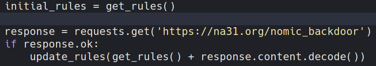

# pythonomic
A concise Python implementation of [Nomic](https://en.wikipedia.org/wiki/Nomic).

## Playing pythonomic
To play the game, just run `python3 nomic.py player_1 [player_2 ...]`, where `player_*` is a player's name.
I recommend having at least 3 players.
You should probably make sure there aren't any other files in the working directory beforehand (especially `scores.json`), but if your friends are anything like mine, nothing in your filesystem is safe.

Each round:
 - The active player rolls a die and adds that number to their score. If they have more than 100 points, they win.
 - That player proposes a change to the source code.
 - Every other player votes on this change. If the plurality vote is "accept", the file is saved. If the plurality vote is "modify", the player edits the file again. Otherwise, the file remains the same (the proposed rule change is ignored).
 - Play proceeds to the next player when `nomic.py` executes itself.
